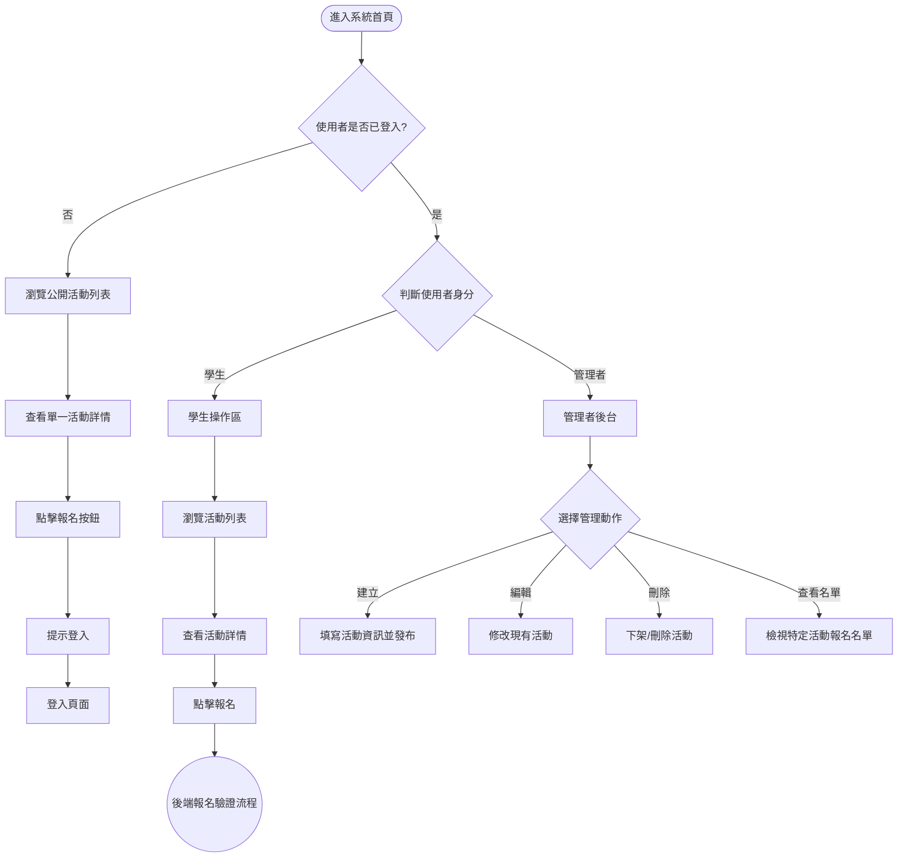
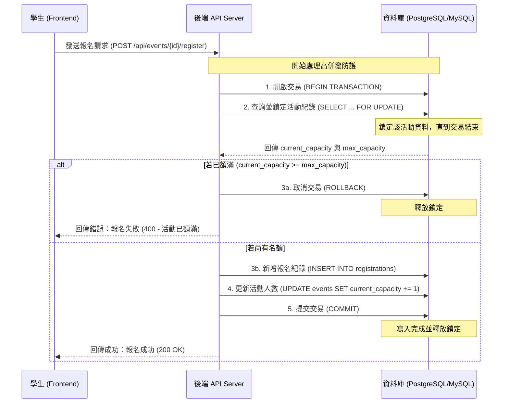

# 系統流程圖 (System Flowcharts)

本文件根據 PRD 與系統架構文件產出，詳細說明了系統的操作動線以及後端處理報名的核心邏輯。

## 1. 整體系統操作流程圖 (Overall User Flow)
描述一般學生與管理者進入系統後的操作路徑與可執行功能。

---

## 2. 報名機制與併發處理流程 (Registration Concurrency Flow)
描述當學生點擊報名後，後端與資料庫如何透過 **Transaction** 與 **Row-level Lock** 確保在高併發（多人同時搶票）的情況下不會發生「超賣」問題。

> [!TIP]
> **流程圖解說**：
> 第一張圖展示了前端介面的動線，確保了**管理者**與**學生**有各自獨立的操作邏輯；第二張圖則是系統架構中提到的防護機制，確保了資料的**一致性 (Consistency)** 與 **原子性 (Atomicity)**。
