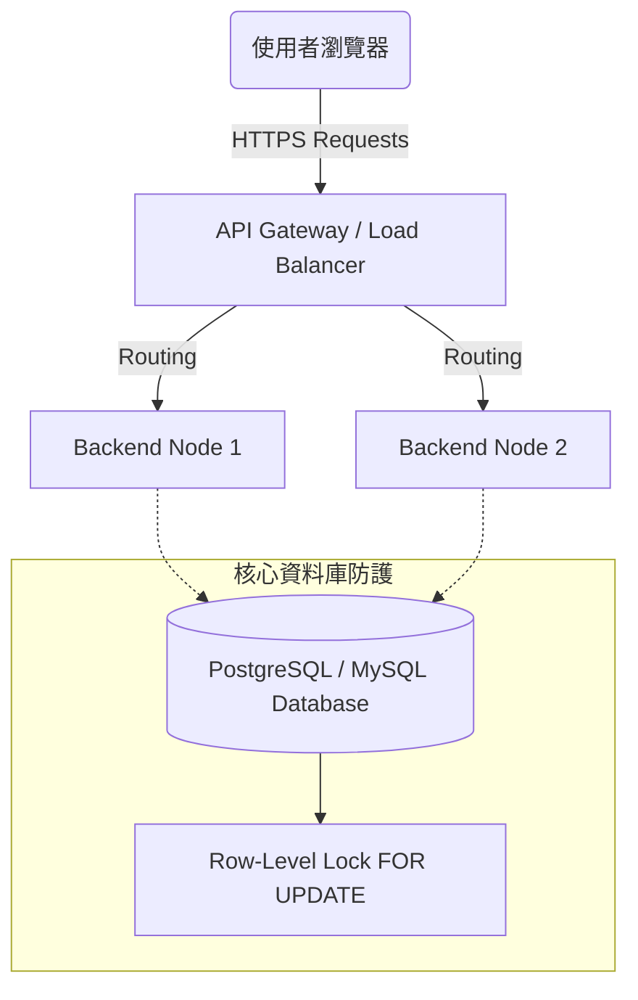

# 系統架構設計文件：活動報名系統

## 1. 技術架構說明

本專案採用**前後端分離 (Frontend-Backend Separation)** 架構，以確保系統具備高擴展性與維護性，能承受大量併發流量。

### 選用技術與原因
- **前端架構：現代前端框架 (如 React / Vue.js 等)**
  - **原因**：使用者在搶票與報名時需要即時的 UI 反饋。前後端分離可將畫面渲染負擔轉移至客戶端，伺服器只需專注於處理報名邏輯與 JSON 資料，提高整體效能。
- **後端框架：RESTful API Server (如 Node.js, Spring Boot, FastAPI)**
  - **原因**：專注提供高效率的 API，方便擴展及橫向負載均衡 (Load Balancing)，並處理報名時的複雜業務邏輯與驗證。
- **資料庫：PostgreSQL / MySQL**
  - **原因**：報名系統對於「交易 (Transaction)」的完整性要求極高。關聯式資料庫原生支援 ACID 特性，並提供 Row-level Lock (行級鎖) 機制，這是防止活動名額「超賣」的關鍵。

## 2. 核心架構圖

以下為系統的整體部署架構，展示客戶端、應用伺服器與資料庫層的關聯：



## 3. 關鍵設計決策

1. **防止超賣 (High Concurrency 防護)**
   - **問題描述**：當 100 個人同時搶 5 個名額時，一般的 Select-Then-Update 會導致多筆請求同時拿到「還有名額」的狀態，導致超賣。
   - **解決方案**：採用悲觀鎖 (Pessimistic Locking)。在查詢活動剩餘人數時，使用 `SELECT ... FOR UPDATE` 鎖定該活動列，直到交易 `COMMIT` 或 `ROLLBACK` 為止。這樣可以強迫同時間的併發請求依序排隊處理，確保 `current_capacity` 計算完全準確。

2. **身份驗證與授權 (Authentication & Authorization)**
   - **決策**：採用 JWT (JSON Web Tokens) 進行無狀態 (Stateless) 驗證。前端登入後取得 Token，後續在發送報名 API (POST `/api/events/{id}/register`) 時必須在 Header 中帶上 JWT，以辨識為「學生」或「管理者」，防止惡意請求越權操作。

3. **RESTful API 設計規範**
   - 系統內部將嚴格遵守 REST 原則：
     - `GET /api/events`：取得公開活動列表
     - `POST /api/events/{id}/register`：學生執行報名
     - `POST /api/admin/events`：管理者新增活動
     - `GET /api/admin/events/{id}/registrations`：管理者檢視報名名單

## 4. 專案資料夾結構規劃

```text
event_registration_backend/
├── src/
│   ├── controllers/      # 處理 API 請求與回應 (例如 EventController)
│   ├── services/         # 核心業務邏輯，包含高併發的 Transaction 處理
│   ├── models/           # DB Schema 定義 (User, Event, Registration)
│   ├── middlewares/      # JWT 權限驗證攔截器
│   ├── routes/           # API 路由綁定
│   └── config/           # 資料庫連線配置與環境變數
├── package.json          # 或對應的依賴套件管理檔
└── server.js             # 應用程式啟動入口
```
