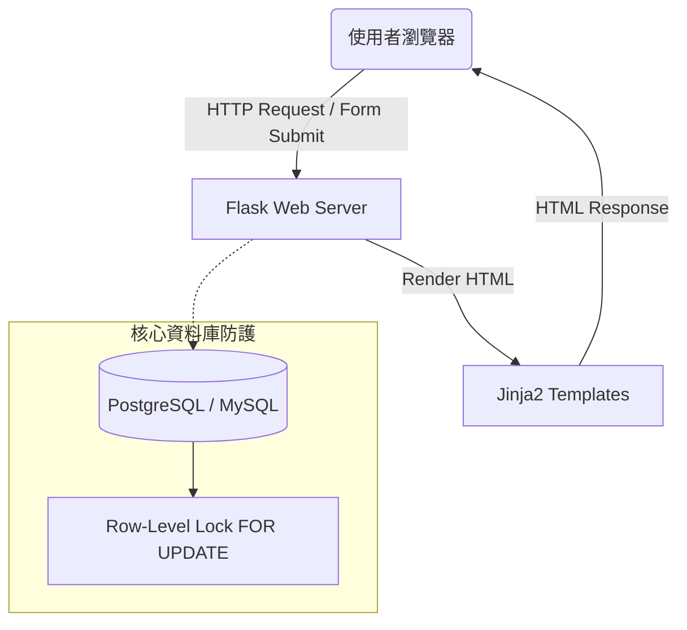

# 系統架構設計文件：活動報名系統

## 1. 技術架構說明

本專案採用**伺服器端渲染 (Server-Side Rendering, SSR)** 架構，由後端直接產生 HTML 頁面並回傳給使用者，適合快速開發與維持簡單的開發心智模型。

### 選用技術與原因
- **後端框架：Python + Flask**
  - **原因**：Flask 輕量且彈性，適合快速打造 MVP。透過 Flask 的路由系統與 SQLAlchemy 的結合，可以快速實作報名核心邏輯。
- **模板引擎：Jinja2**
  - **原因**：與 Flask 高度整合，能直接將資料庫讀取的資料嵌入 HTML 頁面中，並內建自動轉義功能，有效防範 XSS 攻擊。
- **資料庫：PostgreSQL / MySQL**
  - **原因**：報名系統對於「交易 (Transaction)」的完整性要求極高。關聯式資料庫原生支援 ACID 特性，並提供 Row-level Lock (行級鎖) 機制，這是防止活動名額「超賣」的關鍵。

## 2. 核心架構圖

以下為系統的整體部署架構，展示瀏覽器、Flask 應用程式與資料庫的關聯：



## 3. 關鍵設計決策

1. **防止超賣 (High Concurrency 防護)**
   - **問題描述**：當 100 個人同時搶 5 個名額時，一般的 Select-Then-Update 會導致多筆請求同時拿到「還有名額」的狀態，導致超賣。
   - **解決方案**：採用悲觀鎖 (Pessimistic Locking)。在查詢活動剩餘人數時，使用 `SELECT ... FOR UPDATE` 鎖定該活動列，直到交易 `COMMIT` 或 `ROLLBACK` 為止。這樣可以強迫同時間的併發請求依序排隊處理，確保 `current_capacity` 計算完全準確。

2. **身份驗證與授權 (Authentication & Authorization)**
   - **決策**：採用 Flask 內建的 Session 或是 Flask-Login 套件來管理登入狀態。登入後，將使用者 ID 與角色 (`student` 或 `admin`) 存入 Server-side Session。在需要權限的路由加上對應的檢查。

3. **路由與表單提交規範**
   - 由於依賴 HTML 原生表單，所有的操作僅限於 `GET` 與 `POST` 方法：
     - `GET`：用於渲染檢視頁面 (例如列表、表單頁面)。
     - `POST`：用於處理資料的異動 (新增、更新、刪除)，處理完畢後將重導向 (Redirect) 至適當的 GET 路由，避免使用者重新整理時重複提交表單。

## 4. 專案資料夾結構規劃

```text
event_registration_backend/
├── app/
│   ├── __init__.py       # Flask 應用程式初始化與設定
│   ├── models/           # SQLAlchemy DB Schema (user.py, event.py, registration.py)
│   ├── routes/           # Flask 路由 (auth.py, event.py, registration.py)
│   └── templates/        # Jinja2 HTML 模板
│       ├── base.html
│       ├── auth/
│       ├── events/
│       └── registrations/
├── database/             # 資料庫相關腳本 (schema.sql)
├── docs/                 # 專案文件 (PRD, ARCHITECTURE, ROUTES)
└── run.py                # 應用程式啟動入口
```
