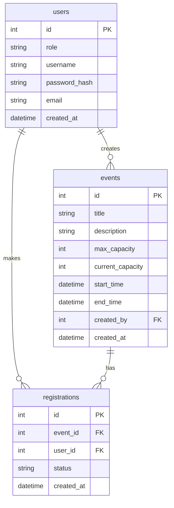

# 資料庫設計文件 (DB Design)

本文件根據 `PRD.md` 與 `ARCHITECTURE.md` 產出，定義了活動報名系統的核心資料表結構，並針對 PostgreSQL 進行最佳化，確保能支援高併發的行級鎖 (Row-level Lock)。

## 1. 實體關係圖 (ER Diagram)

以下為本系統核心資料表的實體關聯圖，主要分為使用者 (`users`)、活動 (`events`) 以及報名紀錄 (`registrations`)。

## 2. 資料表詳細說明

### 2.1 `users` 資料表
用於存放系統的所有使用者，包含學生與管理者。

| 欄位名稱 | 型別 | 必填 | 說明 |
| --- | --- | --- | --- |
| `id` | SERIAL (INT) | Y | Primary Key, 自動遞增 |
| `role` | VARCHAR(50) | Y | 角色 (`student` 或 `admin`) |
| `username` | VARCHAR(100) | Y | 登入帳號，需唯一 |
| `password_hash` | VARCHAR(255) | Y | 密碼雜湊值 |
| `email` | VARCHAR(255) | Y | 電子信箱，需唯一 |
| `created_at` | TIMESTAMP | Y | 帳號建立時間 |

### 2.2 `events` 資料表
用於存放活動詳細資訊與報名容量控管。

| 欄位名稱 | 型別 | 必填 | 說明 |
| --- | --- | --- | --- |
| `id` | SERIAL (INT) | Y | Primary Key, 自動遞增 |
| `title` | VARCHAR(255) | Y | 活動標題 |
| `description` | TEXT | N | 活動詳細描述 |
| `max_capacity` | INT | Y | 報名人數上限 |
| `current_capacity`| INT | Y | 目前已報名人數 (預設 0) |
| `start_time` | TIMESTAMP | Y | 活動開始時間 |
| `end_time` | TIMESTAMP | Y | 活動結束時間 |
| `created_by` | INT | Y | 建立此活動的管理員 ID (FK -> users.id) |
| `created_at` | TIMESTAMP | Y | 活動建立時間 |

### 2.3 `registrations` 資料表
紀錄學生對特定活動的報名狀態。

| 欄位名稱 | 型別 | 必填 | 說明 |
| --- | --- | --- | --- |
| `id` | SERIAL (INT) | Y | Primary Key, 自動遞增 |
| `event_id` | INT | Y | 報名的活動 ID (FK -> events.id) |
| `user_id` | INT | Y | 報名的學生 ID (FK -> users.id) |
| `status` | VARCHAR(50) | Y | 報名狀態 (`success`, `cancelled`) |
| `created_at` | TIMESTAMP | Y | 報名時間 |
